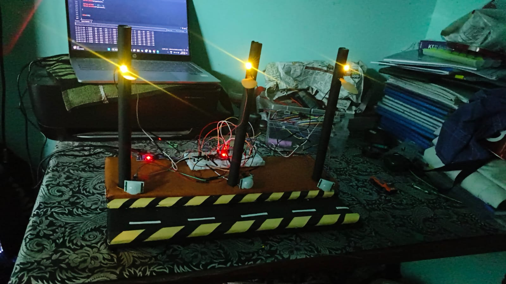

# 🌞 Smart Predictive Solar Street Lighting System

> An ESP32-based solar street lighting prototype with adaptive brightness and a predictive multi-pole lighting concept.



## 📌 About the Project

Traditional street lights often remain at high brightness even when there is little or no traffic. This can result in unnecessary energy consumption.

This project proposes a **smart solar street lighting system** that adjusts the brightness of the lights based on ambient light and detected motion. The system is designed around an ESP32 and can be extended to multiple lighting poles that coordinate with each other.

The main idea is to create a **moving wave of illumination** along a road, where the upcoming lighting zone can be activated as movement progresses.

---

## 🎯 Problem Statement

Conventional street lights may consume energy continuously even when roads are empty.

This project aims to:

* Reduce unnecessary lighting power consumption
* Provide brighter illumination when movement is detected
* Use solar energy for sustainable operation
* Create a predictive lighting concept for multiple street-light poles

---

## 💡 How It Works

The prototype uses:

* **PIR sensor** → Detects motion
* **LDR sensor** → Detects ambient light
* **ESP32** → Controls the system
* **LED** → Represents the street light
* **MOSFET** → Controls the LED output

### Basic Operation

```text
🌙 Night / Low Ambient Light
          ↓
    Low Brightness
          ↓
   Motion Detected
          ↓
    High Brightness
          ↓
    Motion Ends
          ↓
     Timeout
          ↓
    Low Brightness
```

The multi-pole version is designed so that information from one pole can be used to activate the next lighting zone, creating a **predictive wave of light**.

---

## ✨ Key Features

* ☀️ Solar-powered concept
* 🔋 Battery energy storage
* 💡 Adaptive LED brightness
* 🚶 PIR-based motion detection
* 🌙 LDR-based ambient-light detection
* 🎛️ ESP32-based control
* 🛣️ Multi-pole lighting concept
* ⚡ Energy-efficient operation
* 🔌 Embedded control system

---

## 🔧 Hardware Components

| Component               | Purpose                 |
| ----------------------- | ----------------------- |
| ESP32-WROOM-32          | Main controller         |
| HC-SR501 PIR            | Motion detection        |
| LDR + LM393             | Ambient light detection |
| LED                     | Street-light simulation |
| IRLZ44N MOSFET          | LED switching/control   |
| MT3608                  | Boost converter         |
| 18650 Li-ion battery    | Energy storage          |
| Solar panel             | Solar energy generation |
| Solar charge controller | Battery charging        |
| 220Ω resistor           | LED current limiting    |

---

## 📍 Prototype Pin Configuration

| Component            | ESP32 Pin |
| -------------------- | --------: |
| PIR Sensor           |   GPIO 27 |
| LDR                  |   GPIO 34 |
| LED / MOSFET Control |   GPIO 25 |

> Pin assignments may change in future hardware versions.

---

## ⚙️ Prototype Working

The prototype was tested using a three-pole lighting setup controlled by an ESP32.

The demonstrated brightness behavior was:

```text
No Motion
   ↓
~35% Brightness

Motion Detected
   ↓
100% Brightness

Motion Ends
   ↓
Timeout
   ↓
~35% Brightness
```

The brightness levels and timeout can be modified in the Arduino code.

---

## 🔋 Solar Power Architecture

```text
☀️ Solar Panel
      ↓
🔋 Charge Controller
      ↓
🔋 18650 Battery
      ↓
⚡ Boost Converter
      ↓
🧠 ESP32
      ↓
💡 LED Lighting
```

---

## 🧠 Predictive Multi-Pole Concept

The main idea is to coordinate multiple street-light poles.

```text
        POLE 1          POLE 2          POLE 3

       💡              💡              💡
       │               │               │
      PIR             PIR             PIR
       │               │               │
       └───────►───────┴───────►───────┘
              Movement Direction →
```

When movement is detected at one lighting zone, the next zone can be prepared to provide illumination ahead of the moving person or vehicle.

The current prototype demonstrates the lighting-control concept using a **centralized ESP32**. A future version can use individual controllers and wireless communication between poles.

---

## 📊 Expected Benefits

* Reduced unnecessary lighting
* Better utilization of stored solar energy
* Improved illumination around moving objects
* Suitable for low-traffic roads
* Reduced dependence on grid electricity
* Scalable multi-pole architecture

---

## 🚀 Future Improvements

Future versions could include:

* 📡 Wireless communication between poles
* 🔋 Improved battery management
* ☀️ MPPT-based solar charging
* 💡 High-power LED street-light modules
* ⚡ Dedicated LED current driver
* 💤 ESP32 deep-sleep power management
* 📊 Energy-consumption monitoring
* 🤖 Vehicle/person classification
* 🌐 Optional IoT monitoring
* 🧠 More advanced predictive movement detection

---

## 🛣️ Potential Applications

* Rural roads
* Village streets
* Agricultural roads
* College campuses
* Industrial areas
* Low-traffic roads
* Remote locations
* Solar-powered infrastructure

---

## 📷 Project Images

Project photographs will be added here.

```text
images/
├── prototype.jpg
├── circuit.jpg
├── three_pole_setup.jpg
└── testing.jpg
```

After uploading the images, they can be displayed directly in this section.

---

## 💻 Software & Tools

* Arduino IDE
* Embedded C/C++
* ESP32
* Wokwi
* GitHub

---

## 👨‍💻 Author

**Nishaath Hussain A.**

Electronics and Communication Engineering

### Areas of Interest

* Embedded Systems
* IoT
* Digital Electronics
* VLSI
* Microcontrollers
* Smart Energy Systems

---

## 📁 Repository Structure

```text
smart-predictive-street-light/
│
├── README.md
│
├── src/
│   └── street_light.ino
│
├── images/
│   ├── prototype.jpg
│   ├── circuit.jpg
│   └── testing.jpg
│
└── docs/
    └── project_report.pdf
```

---

## ⭐ Project Status

**Current Status:** Prototype completed and tested.

The current version demonstrates motion-based adaptive lighting using ESP32, PIR, LDR and LED control. The predictive multi-pole communication concept is planned for further development.

---

## 📜 License

This project is intended for educational, academic and prototype development purposes.
